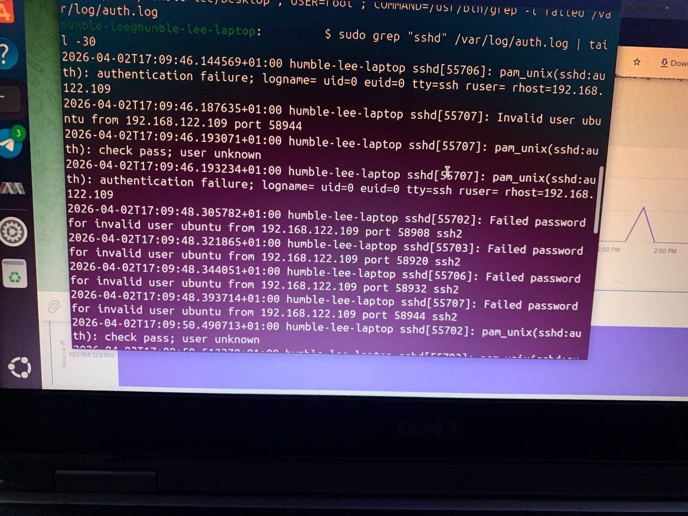
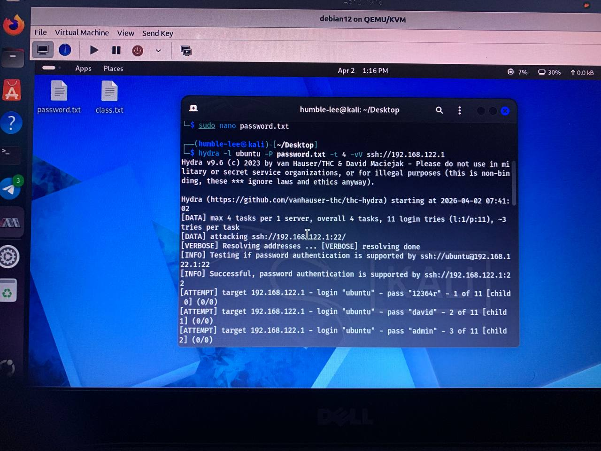
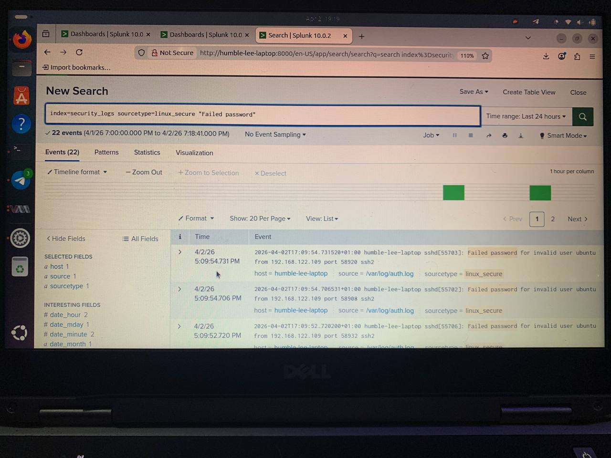
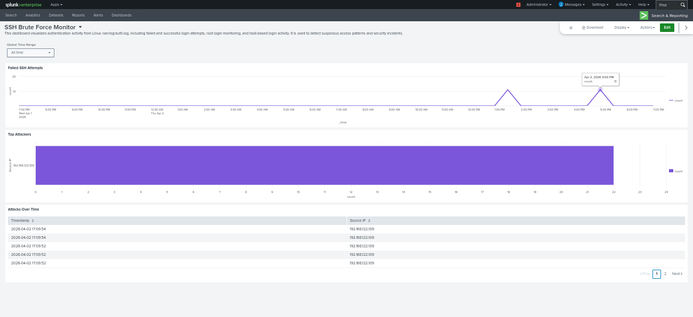
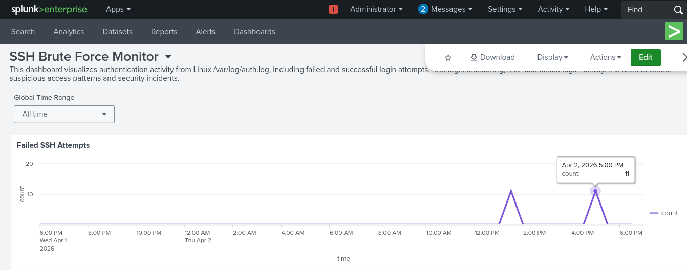
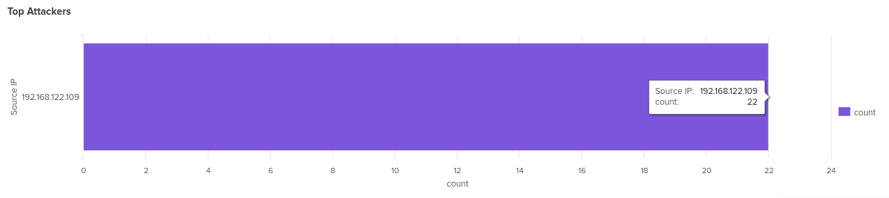
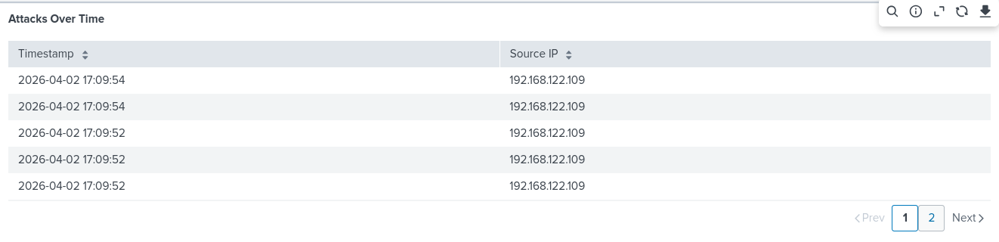

# 🔐 SSH Brute Force Detection Lab

## 🎯 Project Overview

This project demonstrates a complete Security Information and Event Management (SIEM) implementation using Splunk to detect and visualize SSH brute force attacks. A simulated attack was launched from Kali Linux using Hydra against an Ubuntu target, with Splunk ingesting, analyzing, and visualizing the attack patterns in real-time.

## 🛠️ Technologies Used

| Tool | Purpose |
|------|---------|
| Splunk Enterprise | SIEM platform for log ingestion and analysis |
| Kali Linux | Attacker VM running Hydra |
| Ubuntu 22.04 | Target host with SSH service |
| Hydra | Password brute force tool |
| KVM | Virtualization platform |

## 📊 Attack Simulation Details

- Attack Type: SSH Password Brute Force
- Target User: ubuntu
- Source IP: 192.168.122.109 (Kali VM)
- Target IP: 192.168.122.1 (Ubuntu Host)
- Attack Time: April 2, 2026 - 17:09:54 (5:09 PM)
- Total Attempts: 22 failed logins
- Attack Tool: Hydra v9.6

## 📈 Dashboard Features

| Panel | Visualization | Purpose |
|-------|---------------|---------|
| Failed SSH Attempts | Line Chart | Attack intensity over time |
| Top Attackers | Bar Chart | Identify malicious source IPs |
| Attacks Over Time | Table | Detailed forensic evidence |

## 🖼️ Dashboard Screenshots

###  Lab Environment -Ubuntu Auth.log

*Ubuntu host logging SSH failed password attempts from kali VM*

### Attack Simulation -Kali Hydra

*Kali Linux running Hydra brute force attack against Ubuntu SSH*

### splunk Search Results

*Splunk search showing ingested SSH failure logs with timestap*

### Full Dashboard View

*Complete Splunk dashboard with all three visualization panels*

### Attack Spike Detection (Line Chart)

*Line chart showing attack spike at 17:09 with 11 failed attempts*

### Top Attacker Identification (Bar Chart)

*Bar chart identifying 192.168.122.109 as source of 22 attempts*

### Detailed Attack Log (Table)

*Timestamped evidence of each failed authentication attempt*

## 🔍 Sample SPL Queries

### Time-based Attack Analysis
```spl
index=security_logs sourcetype=linux_secure "Failed password"
| timechart count


### Top Attackers Identification
```spl
index=security_logs sourcetype=linux_secure "Failed password"
| stats count by host
| rename host as "Source IP"

### Detailed Attack Table
```spl
index=security_logs sourcetype=linux_secure "Failed password"
| rex "^(?<log_time>\d{4}-\d{2}-\d{2}T\d{2}:\d{2}:\d{2})"
| rex "from (?<src_ip>\d+\.\d+\.\d+\.\d+)"
| eval Timestamp = strftime(strptime(log_time, "%Y-%m-%dT%H:%M:%S"), "%Y-%m-%d %H:%M:%S")
| table Timestamp, src_ip
| rename src_ip as "Source IP"
| head 20

### Project Structure
├── README.md                 # Project overview
├── screenshots/              # All dashboard screenshots
└── queries/                  # SPL query files

### How to Recreate This Lab
1. set up ubuntu target with SSH enabled
2. configure Splunk to monitor /var/log/auth.log
3. Launch Kali VM with network access to ubuntu
4. Run Hydra attack:
   hydra -l ubuntu -P password.txt ssh://[TARGET IP]
5. Verify logs in Splunk search & Reporting
6. Create dashboard using dashboard studio
7. Add Visualization (Line chart, Bar chart,Table)

### Skill Demonstrated
* SIEM implementation and configuration
* Security Log Analysis
* Splunk SPL (Search Processing Language)
* Dashboard Design and Visualization
* Attack Simulation (Red Team)
* Threat Detection and Alerting
* Technical Documentation

### Project Date
April 2026
| sort - count
